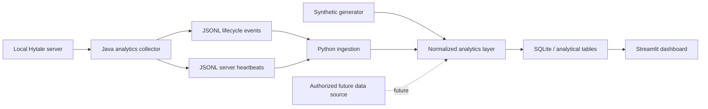

# Hytale Player & Server Analytics


I built this project to explore how I would approach **player analytics, server telemetry, retention, and data quality for Hytale** without pretending I had access to Hypixel Studios' private production data.

The project has two deliberately separate data tracks:

1. **Synthetic analytics** — reproducible simulated player/session/server data that lets me design and test the analytics workflow at useful scale.
2. **Observed local server data** — genuine events and server-health measurements captured from a Hytale server I controlled using my own Java collector.

> This is an independent portfolio project. It is not affiliated with Hypixel Studios, and I do not present synthetic or local-server observations as Hytale-wide production KPIs.

## Why I built it

I started with synthetic data because I did not have access to Hytale's internal production telemetry. Instead of fabricating “real” player statistics, I generated a reproducible dataset and used it to build the analytics pipeline first.

After that worked, I built a **Java Hytale server collector**, compiled it against the Hytale server JAR, installed it on a local server, joined with the matching client, played a short session, left, and ingested the resulting JSONL telemetry back into the project.

That means this repository demonstrates both sides of the problem:

- **Can I design player/server analytics at useful scale?** — synthetic demo.
- **Can I collect genuine Hytale server observations safely and analyze them?** — observed local server data.

## What this project demonstrates

- Python analytics pipelines
- SQL + SQLite data modelling
- Streamlit / Plotly dashboards
- Reproducible synthetic-data generation
- Java server-plugin development
- Player connect/disconnect session reconstruction
- Server heartbeat ingestion
- JVM memory and world tick-duration monitoring
- Data-quality validation
- Privacy-aware player pseudonymization
- Clear separation of simulated, observed, and unavailable production data

## Data sources

| Data source | Status | Purpose |
|---|---|---|
| Synthetic demo data | Available | Engagement, retention, feature usage and server-operations analytics at useful scale |
| Local Hytale collector | Observed | Real lifecycle and server-health observations from a server I controlled |
| Hypixel Studios production telemetry | Not available | I do not claim access to private Hytale-wide data |

## First validated observed-data run

In my first validated local capture, I confirmed that the collector could:

- capture `player_connect`
- capture the matching `player_disconnect`
- reconstruct a complete player session
- pseudonymize the player identifier
- record 60-second server heartbeats
- observe concurrency moving from 0 → 1 → 0
- record JVM memory usage
- record observed world tick duration
- pass the project's data-quality checks

I treat this as a **pipeline validation run**, not as evidence about the wider Hytale player population.

## Architecture



## Dashboard

### Project Story
Explains why I began with synthetic data, how I moved to observed local Hytale data, what I noticed in the first capture, and what I do not claim.

### Synthetic Analytics Demo
Demonstrates player/session KPIs, DAU, feature usage, retention, acquisition cohorts, server-operations demo metrics and anomaly samples using reproducible simulation data.

### Observed Server Data
Displays only telemetry captured from my local Hytale collector: completed sessions, pseudonymous players, concurrency, JVM memory, world tick duration, disconnect reason and data-quality checks.

### Data Provenance
Documents where each dataset came from and what conclusions are safe to make from it.

## Privacy boundary

The collector uses an HMAC-derived pseudonymous player identifier and intentionally excludes:

- usernames
- raw player UUIDs
- IP addresses
- chat content
- authentication tokens

Real local telemetry is ignored by Git by default.

## Repository structure

```text
collector/              Java Hytale analytics collector
dashboard/              Streamlit portfolio application
data/
  raw/                  generated synthetic inputs
  processed/            generated SQLite database
  observed/             local observed telemetry outputs
docs/                   architecture, data dictionary and project story
sql/                    schema and portfolio queries
src/                    generators, ingestion and metrics
tests/                  pipeline and collector-ingestion tests
.github/workflows/      CI tests
```

## Run locally

```bash
python -m pip install -r requirements.txt
python src/generate_demo_data.py
python src/build_database.py
python -m streamlit run dashboard/Portfolio_Story.py
```

## Ingest observed collector data

```bash
python src/ingest_collector.py   --events path/to/analytics-events.jsonl   --heartbeats path/to/server-heartbeats.jsonl   --output-dir data/observed
```

See `collector/README.md` for the plugin build/install workflow.

## Tests

```bash
python -m pytest -q
```

GitHub Actions also runs the tests from `.github/workflows/tests.yml`.

## What I would do with authorized Hytale production data

If Hytale provided an official dataset or authorized analytics API, I would extend this architecture toward:

- D1 / D7 / D30 cohort retention
- new vs returning players
- feature adoption and progression
- update / LiveOps impact analysis
- server-region reliability
- capacity and performance analysis
- creator/server ecosystem analytics
- anomaly detection and alerting

## Current limitations

- The observed dataset is intentionally small because it came from a controlled local validation run.
- Synthetic retention and server metrics demonstrate analytical logic, not real Hytale behaviour.
- I do not have access to Hypixel Studios' private production telemetry.
- Performance observations from one local machine cannot be generalized to Hytale servers overall.

## Project status

**Phase 1:** synthetic player/server analytics — complete  
**Phase 2:** local Hytale collector + observed-data ingestion — validated  
**Next:** richer opt-in events, improved cohorts, and multi-server/community telemetry only with explicit server-owner participation.

## Author

**Ayoleyi Gbenga-Ayodeji**  
GitHub: [Ayoleyi-dev](https://github.com/Ayoleyi-dev)

## Disclaimer

Hytale and related marks belong to their respective owners. This repository is an independent portfolio project and is not endorsed by or affiliated with Hypixel Studios.
